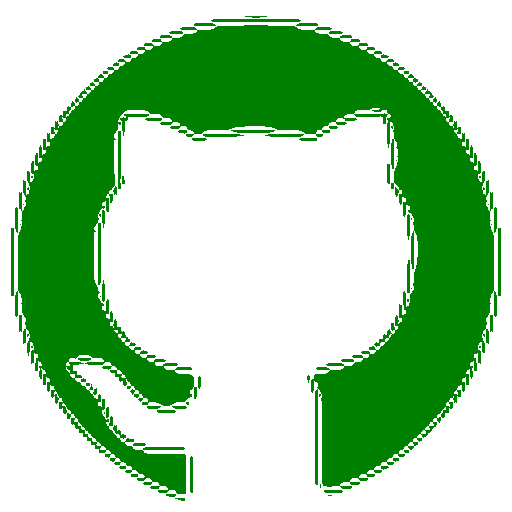

# Technical Exercise

Exercise: 
```
We want users to upload a badge: an avatar within a circle. Create a function taking a png as input and verifying that:

- Size = 512x512
- The only non transparent pixels are within a circle.
- That the colors is the badge give a "happy" feeling.

Additionally, you can create a parallel function that converts the given image (of any format) into the specified object.
```


### Solution

(if you want to just directyl to the execution part [click here](#example-of-execution), The relevant part of the code can be found in `logic.py` in the function `base` or just follow the main file.)


I'm new to image manipulation, but I immediately chose Python as my first attempt due to its convenience and simplicity. I found Pillow (PIL) and after some attempts I found that it was a good choise for me. 

I approach the problem by splitting it steps:

1. Find the image format and convert it if need

2. Check if the size is correct and in case resize

3. Create a circle of transparent pixels 

4. Find the color palette and determine if it's happy of not 

The **point 1.** was easy to address thanks to PIL and the possibility to convert the image by simply save it back in a different format.

`
    img.save(path,"PNG")
`

For the **point 2.** I found that PIL provide 2 ways of resizing an image, by using `Image.thumbnail()` or by using `Image.resize()`.
Even if `Image.thumbnail()` use a scaled approach and so the image is not cutted during resize, it does not provide alwasys an output of the correct target size (512x512) but it will rather be an approximated one. Since this I use `Image.resize()` with the algorithm `Lanczos` as antialias algorithm to kepp a good quality while resizing.

For the **point3** my intuition was to check the pixel transparency. In fact when you have an image that use the color space RGBA you can check the alpha channel to understand if the pixel is saturated or not. If the pixel is not saturated, you can simply replace it with (255, 0, 0, 0) to make it transparent

For the **point4**, colors. In this case `Image.getpalette()` was not working and so I iterate over the image to find all the colors to determine the palette, then to determine if it was an happy palette one or not.
My simple approach to determine if a palette of colors is 'happy' was to define which colors evoke a 'happy' feeling, I decided that: *red, blue, yellow, green, pink and orange* were happy colors.
At this point we need a way to check if a given color is in the list of happy colors.
To determine this you should notice that `(255, 0, 0, 1)` is **red** even `(255, 1, 0, 1)` is **red** and even `(255, 0, 1, 0.9)`. is still **red**. 
I tried two approaches (based on intuition and consulting GPT). The first approach involved considering only a section of the [HSL](https://en.wikipedia.org/wiki/HSL_and_HSV#/media/File:Hsl-hsv_models.svg
) color space as the 'happy' color area. an area of "happy" color. But the result of the categorization was not good (check `./src/logic.py:is_happy_old(rgba)`), but by dropping the information of the alpha channel (saturation) the categorization start to be acceptable (check `./src/logic.py:is_happy(rgba)`) at least in the space of the samples that I'm considering and so I stick for the approach.

Another problem is that an image can have a lot of colors, and not all of them can be considered relevant during the analysis. Given this unless the image has only few colors ,for example the `github` sample you can run, does not make sense too much to maitain this approach but we would like to take only the dominant colors. To solve this problem I use a very basic clustering algorithm **KMeans** from `sklearn.cluster`, The idea was to identify the most prominent colors in the image by grouping them into clusters and pick the center of it (My datascience skills were a bit rusty). After this just following the same approach as before with the dominant colors of the palette. 
Finally, an image is considered 'happy' if it contains more 'happy' colors than 'sad' colors

At this point from the exercise I also understand that if the image is a sad image you make it an happy one.This took me some time, and I will provide additional comments in the [Notes section](#side-notes).
Anyway the actual given solution substitude the colors only if there are just few of them (try yourself with `github` sample), in this case the sad colors are mapped with happy colors and then swapped while iterating over the image.

### Final consideration

If I envision that this assignment is part of a product then there is plenty of room to improve the solution, from the algorithm of substitution of pixel to the color categorization, there are several areas where refinement can significantly improve the product. 
Image processing, while not my primary area of expertise, was a fascinating challenge. For this reason I follow a structured approach that would allow me to break down the problem into manageable components. This segmentation of tasks, I believe, is a vital strategy to address complex issues, ensuring that each element of the solution can be analyzed, improved, and optimized independently.

## Side Notes 

I felt like I might be overengineering the solution; that's why I stopped. I had an idea, but I didn't test it extensively. Instead, I concentrated my efforts on the core part of the entire assignment. I left the incomplete code in the repository as reference but the point was that: If you consider the dominants color while swapping sad colors with happy colors then you have to check all the potential labels for each of the dominant color you have, this is computational expensive if you have an image with a lot of different colors and potentially not accurate at all. I was planning to reduce the complexity by defining a similarity function able to at which pixel belong which dominant color to be able to define the new color. 

If you have further questions or if you're curious, we can discuss this point during the upcoming meeting, which I hope we will have.

### Try solution

Create a virtual env and source it

    Depends a bit on your python version and OS

The project is based only on Pillow so you can just

    > pip install Pillow

To run a random sample just type

    > python3 ./src/main.py

To run a specific sample just type the name without extension for PNG
 files or with extension for other files

    > python3 ./src/main.py <sample_name> 

    > python3 ./src/main.py github

# Example of execution:

Down here there are some examples of execution with logs and information. 

The results are that:

- Conversion works in all cases
- The resizing process does not break the image quality and 
  can potentially work in a real use case
- Color analysis is not sentiment analysis -> very hard to determine if an image is happy from the color palette.
-  Determining the palette can be an expensive task when the clustering algorithm is used. 
- Note about execution time -> does not really matter numerically even because is influences by a wide number of factory, it's just a way to give the idea of the difference between images.

### Sample 1

Sample Info

- home
- 400x400
- png
- expected happy 

| Sample Input | Output Image | Execution Time|
| ------------ |------------ | ------------- |
||  | 13.42 seconds|

```
> python3 ./src/main.py home.jpg
    INFO:root:Parallel - Image path: ./examples/base/home.jpg
    INFO:root:Image format : PNG
    INFO:root:Image mode : RGBA
    INFO:root:Original image size : (599, 371)
    INFO:root:Resizing image
    INFO:root:Happy - Check if the palette colors is happy,
    INFO:root:Palette colors found: 16613
    INFO:root:Start clustering, number of centers: 5
    INFO:root:Is happy? True
    INFO:root:get_palette_sentiment took 13.42 seconds to execute.
    INFO:root:Saving image at ./examples/output/home.png
    INFO:root:base took 13.53 seconds to execute.
```
### Sample 2

Sample Info
- b44
- 400x400
- png
- expected happy 

| Sample Input | Output Image | Execution Time|
| ------------ |------------ | ------------- |
||  | 7.03 seconds|

```
> python3 ./src/main.py b44
    INFO:root:Parallel - Image path: ./examples/base/b44.png
    INFO:root:Image format : PNG
    INFO:root:Image mode : RGBA
    INFO:root:Original image size : (400, 400)
    INFO:root:Resizing image
    INFO:root:Happy - Check if the palette colors is happy,
    INFO:root:Transparent pixel found: (0, 1, 1, 0)
    INFO:root:Palette colors found: 15017
    INFO:root:Start clustering, number of centers: 5
    INFO:root:Is happy? True
    INFO:root:get_palette_sentiment took 6.98 seconds to execute.
    INFO:root:Saving image at ./examples/output/b44.png
    INFO:root:base took 7.03 seconds to execute.
```

### Sample 3

Sample Info
- basket
- 500x900
- png
- No expectation

| Sample Input | Output Image | Execution Time|
| ------------ |------------ | ------------- |
||  |  93.29 seconds|
```
> python3 ./src/main.py basket
INFO:root:Parallel - Image path: ./examples/base/basket.png
INFO:root:Image format : PNG
INFO:root:Image mode : RGBA
INFO:root:Original image size : (500, 900)
INFO:root:Resizing image
INFO:root:Happy - Check if the palette colors is happy,
INFO:root:No transparent pixel found: (0, 0, 1, 0)
INFO:root:Palette colors found: 100799
INFO:root:Start clustering, number of centers: 5
INFO:root:Is happy? True
INFO:root:get_palette_sentiment took 93.15 seconds to execute.
INFO:root:Saving image at ./examples/output/basket.png
INFO:root:base took 93.29 seconds to execute.
```

### Sample 4

Sample Info
- eyes
- 512x512
- png
- expected sad

| Sample Input | Output Image | Execution Time|
| ------------ |------------ | ------------- |
||  | 0.86 seconds|
```
> python3 ./src/main.py eyes

INFO:root:Parallel - Image path: ./examples/base/eyes.png
INFO:root:Image format : PNG
INFO:root:Image mode : RGBA
INFO:root:Happy - Check if the palette colors is happy,
INFO:root:There are no non-transparent pixel out of the circle
INFO:root:Palette colors found: 251
INFO:root:Start clustering, number of centers: 5
INFO:root:Is happy? False
INFO:root:get_palette_sentiment took 0.87 seconds to execute.
INFO:root:Saving image at ./examples/output/eyes.png
INFO:root:base took 0.89 seconds to execute.
```

### Sample 4

Sample Info
- github
- 200x200
- png
- expected sad -> to be colorized

(PS: if you have dark mode maybe you don't see the imagein sample input column)

| Sample Input | Output Image | Execution Time|
| ------------ |------------ | ------------- |
||  | 0.86 seconds|
```
>  python3 ./src/main.py github
INFO:root:Parallel - Image path: ./examples/base/github.png
INFO:root:Image format : PNG
INFO:root:Image mode : RGBA
INFO:root:Original image size : (128, 128)
INFO:root:Resizing image
INFO:root:Happy - Check if the palette colors is happy,
INFO:root:There are no non-transparent pixel out of the circle
INFO:root:Palette colors found: 1
INFO:root:Is happy? False
INFO:root: - Maybe we can fix this..
INFO:root: - Swapping colors [((0, 0, 0, 0), 'green')]
INFO:root:get_palette_sentiment took 1.23 seconds to execute.
INFO:root:Saving image at ./examples/output/github.png
INFO:root:base took 1.25 seconds to execute.
```
